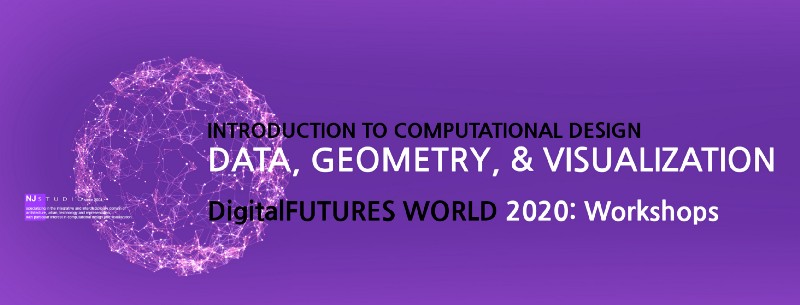

###### DigitalFUTURES WORLD : ARCHITECTS UNITE Workshops
# Introduction to Computational Design: Data, Geometry, and Visualization Using Digital Media

**Short Description:**
This is a hands-on workshop and lecture series about the Introduction to Computational Design for Data and Geometry Visualization for Digital Mapping on Web. For those who are interested in developing both the ideas and skills of data and geometry visualization to understand the data in architectural or urban contexts, this workshop is yours. The workshop consists of three key parts: (1) processing and visualizing data (2) constructing geometries (3) developing a pipeline for an interactive mapping system. Using HTML canvas and ArcGIS JSAPI, we are going to understand the holistic process and the pipeline of data and geometry visualization and mapping. In the workshop, key coding demos and related lectures will happen, and coding exercises with the boilerplate code will be followed as homework after the workshop.

**Keywords:**
Computational Geometry, Visualization, Urban and Architectural Data, web-based

**Timezone:**
North/South Americans Time Zone / GMT 2:00 AM /English version
Asian-Pacific Time Zone 9 / GMT 4:00 AM /Korean version

Language:
[English](https://www.digitalfutures.world/workshops-americas-blog/njlee-en) / [Korean](https://www.digitalfutures.world/workshops-asia-pacific-blog/njlee-kr)

**_Workshop Schedule:_**

_Day 1:_ [_Processing Data and Visualization in Digital Media_](https://medium.com/@nj.namju/1-data-processing-d5111a9857bf)

_Day 2:_ [_Data Processing using Python_](https://medium.com/@nj.namju/2-data-processing-using-python-5edaf5e5d020)

_Day 3:_ [_Typescript and HTML Canvas_](https://medium.com/@nj.namju/3-typescript-html-canvas-d1a45c48021)

_Day 4:_ [_Computational Geometry and Geometry Class_](https://medium.com/@nj.namju/4-computational-geometry-geometry-class-f15d342469d4)

_Day 5:_ [_Pipeline for Data and Geometry Visualization (or CAD system)_](https://medium.com/@nj.namju/5-pipeline-for-data-and-geometry-visualization-b2c9df7c21c7)

_Day 6:_ [_Digital Mapping using ArcGIS JSAPI_](https://medium.com/@nj.namju/6-digital-mapping-using-arcgis-jsapi-626e108d624b)

Digital FUTURES World [_Youtube Playlist Long version_](https://www.youtube.com/playlist?list=PLIyZNoxG7nmlXNW2GSfFVzENf_8T0P4Tc) (English)  
Digital FUTURES World [_Youtube Playlist Short version_](https://www.youtube.com/playlist?list=PLIyZNoxG7nml7jBro3yqZriUppDKAEDjI) (English)

Digital FUTURES World [_Youtube Playlist Long version_](https://www.youtube.com/playlist?list=PLweNVwGgDKEZZyedJi632ULMJ6allmz2s) (Korean)  
Digital FUTURES World [_Youtube Playlist Short version_](https://www.youtube.com/playlist?list=PLweNVwGgDKEbfnKpJKsIkzLqQNyLDZi4J) (Korean)

**Workshop Description & Syllabus:**
With the limited given time, we will try to cover all required steps related to the course works.

Lecture: 15~30%
Overview works: 5~10%
Workshop: 50~60% for overviewing codes, and 10~20% for live coding exercises
Homework: reviewing and typing all materials required for active students
Note: additional materials related to topics

**Workshop Length:**
6 days

**Workshop hours/day:**
1.5 hours

-----
### Workshop Description & Syllabus

Workshop Schedule:
Day 1: [Processing Data and Visualization in Digital Media](https://medium.com/p/d5111a9857bf)  
Introduction to Data processing and Visualization in Grasshopper and Rhino Python

Day 2: [Data Processing using Python](https://medium.com/p/5edaf5e5d020)  
Introduction to Data Processing and Visualization Using Python

Day 3: [Typescript and HTML Canvas](https://medium.com/p/d1a45c48021)  
Introduction to Web Graphics using HTML Canvas API for visualization

Day 4: [Computational Geometry and Geometry Class](https://medium.com/p/f15d342469d4)  
Introduction to Computational Geometry and Visualization

Day 5: [Pipeline for Data and Geometry Visualization (or CAD system)](https://medium.com/p/b2c9df7c21c7)  
Introduction to Development of CAD application

Day 6: [Digital Mapping using ArcGIS JSAPI](https://medium.com/p/626e108d624b)  
Introduction to JSAPI and the Development of a Mapping App

----

### Workshop Schedule :
Workshop Description & Syllabus

#### Day 1: [**Processing Data and Visualization in Digital Media**](https://medium.com/p/d5111a9857bf)  
Introduction to Data processing and Visualization in Grasshopper and Rhino Python

**Keyword**
Variable, Type, Number, Comment, String, Casting, Conditional Statement, Loop, Data Structure, List, Dictionary, Tuple, Function

**Research Overview:**
* Mapping Demo

**Lecture:**
1) Data in Design

**Workshop: Rhino Grasshopper**
1) Python basic and data processing in GH  
2) Mapping and data visualization with [Numerical Mapping Utility Addon](http://www.njstudio.co.kr/main/project/2018_NMU_Development/2018_NMU_Development.html%5C)  
3) Data visualization with [Numerical Image Utility Addon](http://www.njstudio.co.kr/main/project/2018_NIU_Development/2018_NIU_Development.html)

#### Day 2: [**Data processing using Python**](https://medium.com/p/5edaf5e5d020)
Introduction to Data Processing and Visualization Using Python

Research Overview:
* [Politics of Space and its shadows, Exhibition](http://www.njstudio.co.kr/main/project/2017_PoliticsofSpaceAndItsShadows/2017_PoliticsofSpaceAndItsShadows.html)
* [Built Environment Assessment](http://www.njstudio.co.kr/main/project/2016_HarvardCS109_DataScience/index.html)

**Research Overview:**   

**Keyword**  
CSV, JSON, GeoJSON, ZIP, Image Processing, Digital Elevation Model

**Lecture**:  
1) Type of data and file formats

**Workshop**: Google Colab (Jupyter notebook)  
1) Pandas and Numpy lib  
2) Data structure: structured data and semi-structured data  
3) Parse and rebuild CSV, JSON, Geo-JSON   
4) Data processing and visualization

**Additional note:**
Prediction data (SKLearn, Tensorflow)  
Feature reduction

#### Day 3: [**Typescript and HTML Canvas**](https://medium.com/p/d1a45c48021)  
Introduction to Web Graphics using HTML Canvas API for visualization

**Keyword**  
Syntax, Typescript, Canvas API, List, Range, Matrix, Arc, Line, Area, Interaction, Loop

**Research Overview:**
\* [Parkerator](http://www.njstudio.co.kr/main/project/2016_FluxFactoryParkerator/2016_FluxFactoryParkerator.html)  
\* [Agent-based Optimization for Column Distribution](http://www.njstudio.co.kr/main/project/2016_ColumnDistribution/2016_ColumnDistribution.html)  
\* [Design Workflows Integrating Machine Learning and Voxel Representations](http://designju.cafe24.com/main/project/2017_thesisVoxelHarvardGSD/public/)

**Lecture:**  
1) Mapping with JSAPI  
2) Build geometry class, Point, Line, and Area  
3) Develop a pipeline for interactive visualization

**Workshop:** Codepen (HTML Canvas)  
1) The basic syntax of Typescript  
2) Understanding Canvas API  
3) build function: List, Range, matrix  
4) Visualization data using HTML Canvas API

#### Day 4: [**Computational Geometry and Geometry Class**](https://medium.com/p/f15d342469d4)Introduction to Computational Geometry and Visualization

**Keyword**  
Data Structure, Vector, Color, Point, Line, Polyline, Polygon class, Area class, Geo JSON

**Research Overview**:  
\* [Geometry Utility](http://www.njstudio.co.kr/main/project/2015_NGU_Development/2015_NGU_Development.html)  
\* [Dynamic Utility](http://www.njstudio.co.kr/main/project/2015_NGUdynamic_Development/2015_NGUdynamic_Development.html)  
\* [Landscape Utility](http://www.njstudio.co.kr/main/project/2015_NEU_Development/2015_NEU_Development.html)  
\* [Architectural Compiler](http://www.njstudio.co.kr/main/project/2015_AC_Development/2015_AC_Development.html)

**Lecture:**  
1) Construct and compute geometries  
2) Understand the rendering pipelines

**Workshop:** Codepen (HTML Canvas, Three(WebGL))  
1) Vector object and its implementation  
2) Point object  
3) Line object  
4) Area object  
5) Color object  
6) Rendering in ThreeJS  
7) Rendering in Canvas

**Additional note:**  
1) Mesh WebGL vertex and connectivity  
2) Visualizing 3D geometry on Web (Three JS)

#### Day 5: [**Pipeline for Data and Geometry Visualization (or CAD system)**](https://medium.com/p/b2c9df7c21c7)  
Introduction to Development of CAD application

**Keyword**  
Programming Pattern for CAD system, Event, Data flow, Controller flow, Rendering flow

**Research Overview**:  
\* [Small Environment](http://www.njstudio.co.kr/main/project/2016_SmallEnvironments/2016_SmallEnvironments.html)  
\* [Sketch hand](http://www.njstudio.co.kr/main/project/2015_MOptic/2015_SktechHand_Development.html)

**Lecture:**  
1) MVC pattern and flow(data and commands)  
2) programming pattern for CAD system  
3) Interaction for visualization(mouse, keyboard)

**Workshop:** Codepen  
1) data flow  
2) controller flow  
3) rendering flow

**Additional note:**
1) soon

#### Day 6: [**Digital Mapping using ArcGIS JSAPI**](https://medium.com/p/626e108d624b/)  
Introduction to JSAPI and the Development of a Mapping App

**Keyword**  
Projection, Remap, Interpolation, Generalization, ArcGIS JSAPI, Gestalk Principles, Principles of Graphical Integrity, Bertin’s Visualization design space

**Research Overview:**  
\* [Third Place Mobility Energy Consumption](http://www.njstudio.co.kr/main/project/2016_MobilityEnergyConsumptionMITMediaLab/index.html)

**Lecture:**  
1) Projection, remap, interpolation  
2) Generalization  
3) Understand modify Object-oriented programming(OOP) pattern

**Workshop:** Codepen, Github  
1) develop a mapping app with JSAPI based on the boilerplate code

**Additional note**
1) data visualization using [d3](https://d3js.org/)  
2) data visualization using [Amcharts](https://www.amcharts.com/)

**Required Software / Technology:** 
[Google Colab](https://colab.research.google.com/), [Codepen](https://codepen.io/), [GitHub](https://github.com/), [Visual Studio Code](https://code.visualstudio.com/), [Rhino](https://www.rhino3d.com/) [Grasshopper](https://www.grasshopper3d.com/)([Addons](https://www.food4rhino.com/))   
[Python](https://www.python.org/), [Typescript](https://www.typescriptlang.org/), [HTML Canvas API](https://www.w3schools.com/html/html5_canvas.asp%5C), [ArcGIS JSAPI](https://developers.arcgis.com/javascript/)

**Required Software Skills Levels** 
Any coding experiences preferred (one of them: visual programming(GH), javascript, c#, java, or python)

**Required Hardware**
Laptop

-----

#### NJ Namju Lee  
nj.namju@gmail.com
Design, Computation, Data, AI, Visualization specialist
MDes;Harvard, MArch;UCB, B.S;SNUST, Research Fellow; MIT

**Bio**:  
[NJ Namju Lee](https://www.linkedin.com/in/nj-namju-lee-926b3252/) is an architectural designer, researcher, lecturer, and software engineer. He has been the principal of [NJSTUDIO](http://www.njstudio.co.kr/) since 2004, specializing in architecture, computational design, and visualization. He graduated from Seoul National University of Science and Technology(B.S), later, UC Berkeley(MArch), and Harvard GSD(MDes). He researched at UrbanAid Lab at UTS, at SENSEable City Lab and Media Lab(Changing Places Group) at MIT, and at CED, UC Berkeley. He works in the integrative and interdisciplinary domain of built environment and technology, with a particular interest in computational design and visualization. Central to his practice is the use of data as the primary methodology in shaping a design process by integrated computation and visualization.

_Director and founder of_ [_NJSTUDIO_](http://www.njstudio.co.kr) _,_ [_NJS Lab_](http://njslab.com/)_,_ [_NJS Lab Sandbox_](http://www.njslab.com/NJSLabCore/)

[_NJ Blog_](http://www.namju.info) _/_ [_NaverBlog_](http://blog.naver.com/designju/)_(KR) /_ [_NaverCafe(KR)_](https://cafe.naver.com/codefordesign) _/_ [_GitHub_](https://github.com/NamjuLee) _/_ [_Linkedin_](https://www.linkedin.com/in/nj-namju-lee-926b3252/) _/_ [_NJSTUDIO FB_](https://www.facebook.com/NJSLAB/?eid=ARBkMy4JztZ2Gnt6Xt--ReJCpTEMYxFY1yIRkrevz-Q6uLkV-PxHJuleS3ZzJFtBhahQtY0RVBNyQqot)

[_Youtube(eng)_](https://www.youtube.com/channel/UCP4q3a4ogJN1-SbJclJR3Ww?view_as=subscriber) _/_ [_Youtube(kr)_](https://www.youtube.com/channel/UC3Z42uoe9C7Et39h5cLK1dw?view_as=subscriber) _/_ [_Medium_](https://medium.com/@nj.namju) _/_ [_DaumBrunch_](https://brunch.co.kr/@njnamju)

**Data and Design / Computational Design**  
[Lecture](https://www.youtube.com/playlist?list=PLweNVwGgDKEasb4RbUugM4ljH8oULTboc) / [Workshop](https://www.youtube.com/playlist?list=PLweNVwGgDKEb94hRD2OT4bNWhtO0Ggu_o) / [QnA](https://www.youtube.com/playlist?list=PLweNVwGgDKEYzuT2sezSsQCP-me-1Tb7e) / [Digital FUTURES World](https://www.youtube.com/playlist?list=PLweNVwGgDKEZZyedJi632ULMJ6allmz2s) / [DaumBrunch Link](https://brunch.co.kr/@njnamju/64)
