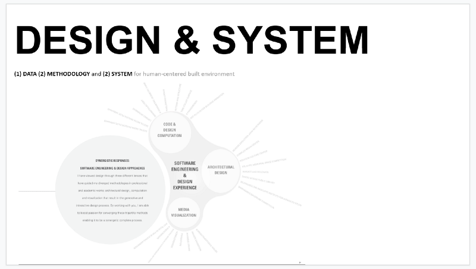
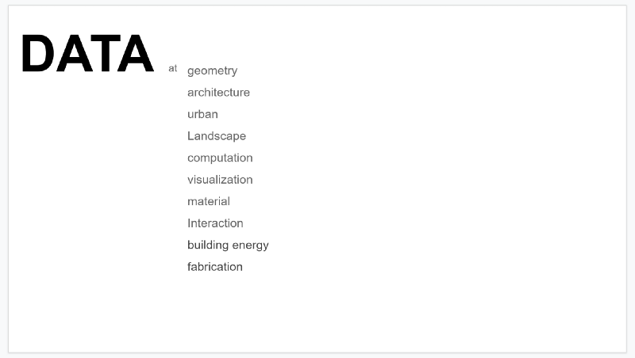
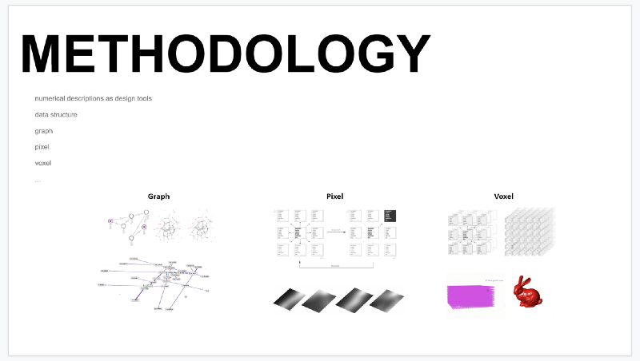
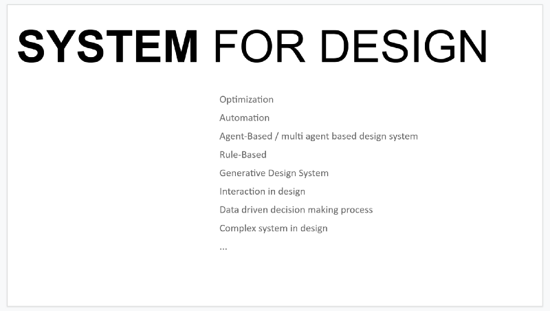

# Data & Design

[_Original article_](https://nj-namju.medium.com/data-design-c21457dc8dc)

Computational Design, NJSTUDIO

[_English Version_](https://www.youtube.com/watch?v=VC-cLerlm4s&t=1s)  
[_Korean Version_](https://www.youtube.com/watch?v=7HwlZaJrTEI&t=626s) 

**New Material for Design**
With the 4th industrial revolution, the importance of data, as a new material, became necessary and inevitable in modern industries in diverse ways, thanks to the developments of computing powers and their infrastructures. Architectural design is no exception. The new material allows us to develop the explicit design process logically than ever before and help make decisions during design iterations. Data could be considered numerical representations or relationships of sections of phenomenons, environments, behaviors, etc., critical in the decision-making process or developing shapes in design. Stochastic and deterministic approaches with data could open opportunities to push and explore the boundaries to the use of data in design.

**Data** is becoming increasingly available not only for specialists but also for designers in diverse ways as a new materials in 21st century. The importance of data has led to the new age of design, and it made possible holistic design approaches in architectural, landscape, and urban design. Optimization, parametric design, data-driven design, and something fundamentally rely on data. The use of data in design is becoming much more significant than ever before. Mainly, the change of our life by autonomous vehicles, IoT, blockchain, or smart cities based on 5G technology will accelerate the way of living and thinking, generating and consuming data every single day.

**Software** is a way to package knowledge in a usable form or mobile or distributed structure. Software is not just a tool, but a bundle of knowledge of technique or method in action series to process data. The software contains lots of fundamental algorithms and logic that people have developed in the history of math, science, and architecture whenever you use a software or CAD program behind the scenes. The data is cooked based on recipes of the knowledge for the software. **The interface** is how to expose the knowledge to others as a set of sequences as a visual form on the screen where designers or users design their custom menus based on given recipes of the algorithms.

**CAD Technology** and interaction was quite mutual around early 2000. However, we have the emergency of new tools that are **Interactive** after that. Real-time graphics, interactive motion analysis and detection, Dynamic optimization system, and machine learning related applications will open the opportunity to explore manifold possibilities in design. As a form of software, the package of knowledge will deploy in different circumstances as they need and interact with the software.

Through **Web Environment**, everything in the world is interconnected with each other. In everyday life, we use email, search the web for information, check the weather, and traffic. We take and share their pictures or videos based on such international services or platforms provided by Google, Amazon, Facebook, Microsoft. Around late 2000, Software industries started migrating their software, products, or apps from the local environment to the web. The CAD industry is no exception. It means that the apps in mobile or browsers we use these days are a getaway of all of our virtual worlds where we talk and develop designs, resulting in data.

**Visualization & Interpretation**  
What is visualization? There would be different definitions in different domains. But It could be considered as a way of printing a result from computational operations as a human visual language on a screen or a paper. A simple math equation gives us a result, such as three from 2 + 1. There would be no misunderstanding happening here because three is just 3 in that straightforward operation. But not every data has a single interpretation of data in this real-world because it is not that simple. Data is a sort of numerical representation of facts, thus the decode and interpretation are needed to understand the meaning of the data.

00:24 — overview : data, methodology, and system — [link](https://youtu.be/VC-cLerlm4s?t=24)

06:43 — urban data / network —[link](https://youtu.be/VC-cLerlm4s?t=403)

08:46 — urban data / machine learning —[link](https://youtu.be/VC-cLerlm4s?t=526)

11:00 — geometry data / deep learning —[link](https://youtu.be/VC-cLerlm4s?t=660)

13:00 — optimization / parametric design — [link](https://youtu.be/VC-cLerlm4s?t=770)

15:58 — structure data / optimization — [link](https://youtu.be/VC-cLerlm4s?t=958)

18:41 — geometry data / dynamics — [link](https://youtu.be/VC-cLerlm4s?t=1121)

20:24 — landscape data / environmental data —[link](https://youtu.be/VC-cLerlm4s?t=1224)

22:28 — image data processing — [link](https://youtu.be/VC-cLerlm4s?t=1348)

25:13 — fabrication data / digital mock-up —[link](https://youtu.be/VC-cLerlm4s?t=1513)

26:07 — material data / computation — [link](https://youtu.be/VC-cLerlm4s?t=1567)

28:20 — interaction / robotics — [link](https://youtu.be/VC-cLerlm4s?t=1700)

31:56 — particle simulation / data — [link](https://youtu.be/VC-cLerlm4s?t=1916)

33:16 — other interests — [link](https://youtu.be/VC-cLerlm4s?t=1997)

34:53 — lecture and workshop series — [link](https://youtu.be/VC-cLerlm4s?t=2093)

35:24 — domains and technologies — [link](https://youtu.be/VC-cLerlm4s?t=2124)

36:37 — keywords — [link](https://youtu.be/VC-cLerlm4s?t=2197)

37:02 — thank you —[link](https://youtu.be/VC-cLerlm4s?t=2222)

**Korean Version —** [link](https://brunch.co.kr/@njnamju/88)