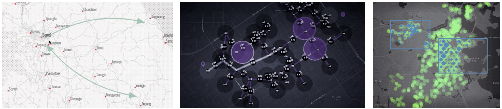
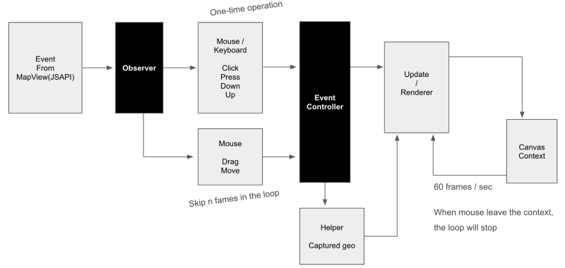

# HTML Canvas Optimization of Rendering Loop with JSAPI for Drawing on Map

**keywords**: mapping, digital mapping, tracing, HTML Canvas, optimization, real-time graphics, JSAPI, ESRI

Are you interested in developing a tool to draw shapes or visualize data on a map? You probably wonder how to optimize your custom renderer with [JSAPI of ArcGIS](https://developers.arcgis.com/javascript/), then this article is yours.

**Why HTML canvas?**

There are no particular reasons that [HTML Canvas](https://www.w3schools.com/graphics/canvas_intro.asp) is the best way of drawing on a Web browser, compared to [WebGL](https://developer.mozilla.org/en-US/docs/Web/API/WebGL_API) or [SVG](https://developer.mozilla.org/en-US/docs/Web/SVG) which could also consider as tools to draw. However, it provides easy and straightforward ways of dynamic drawing on the Web environment. Canvas is known as one of the simple and interactive ways of drawing or visualizing on the Web browser.

**Why JSAPI for Mapping and Visualizing data**

JSAPI, a mapping product of ESRI, provides us lots of powerful API that enable us to analyze, visualize, and draw on a map. HTML Canvas with projections from JSAPI, we could build a custom drawing tool on top of a map. With the Map and MapView objects from the JSAPI, we could create a dynamic drawing tool on the basis of the coordinate systems of both geographical position and screen position.

In this article, although there are many aspects of using HTML Canvas with JSAPI(later I would introduce more fun and exciting stuff), this article focuses on sharing several ways of optimizations of usage of HTML Canvas in real-time graphics with JSAPI(MapView object).

Lets’ remind the conventional and well-known optimization technics of HTML Canvas we could adopt for minimizing the computations and drawings in the rendering loop.

1.  reduce rendering loop
2.  avoid to use Shadow such as `context.shadowBlur`.
3.  avoid use the API: `context.save()` and `context.restore()`
4.  use multiple canvases for different situations: static or animated scene.
5.  use requestAnimationFrame, rather than `setTimeout` or `setInterval`
6.  more and more…

Although ‘`requestAnimationFrame`’ has lots of optimizations of rendering loops, there are some spaces we can optimize the computation explicitly.

**Controlling the rendering loop**

There are more beyond above I mentioned, but, needless to mentions, we do not want to do rendering loops when no interaction coming. Such as when the mouse leaves the div or HTML Canvas context, or after it renders certain loops for finishing started animations, then we could stop the loop without clear the canvas. Thus we still see the shapes or visualization on the map.

Even further optimization, a frame rate could be controlled. For instance, when zooming or panning the map, the low frame rate of the rendering loop shows a sort of jagged animations that could not stick to the map very well. Obviously this is no good for real-time graphics. In this case, we could dynamically switch the frame rate of rendering loop based on the pan or zoom event from MapView object.

**Differentiate tasks**

Most real-time graphics environments, such as Unity, Unreal and so on, there are three distinctive steps: the steps of (1)initialization, (2)updating, and (3)rendering phase in a single loop. Taking advantage of each step becomes a significant role in optimizing the computation and loop. It is not desired for computing the same data in each rendering loop. In this case, we put this computation on the initialization stage. Therefore, in terms of developing the pipeline in the architecture, we need to carefully design the group of data flows to control when necessary.

In the update phase, we could compute meaningful calculations such as checking distances, physics for dynamics, hovering effects and so on. In case that the frame rate became decreasing, we could skip the certain number of the frame to compute because it has nothing to do with the rendering in which it draws actual shapes on screen we can see. Some functions are okay to be executed in 15 or 10 times per sec.

Let’s visit the rendering steps, we could regulate the frame rate freely based on the capability of the computer system, since the update stages have nothing to do with the rendering. From Powerful machine to mobile, I highly recommend you to install a sort of observer to monitor and shift the frame rates in rendering loops. Based on the number of shapes or visualization entities, or depend on the event such as panning or zooming, we could apply different frame rates. In addition, thanks to the parallel processing of GPU, drawing-specific operations are operated in the rendering stage. I mean the separating and isolating of concerns or tasks always could be considered as a good practice for the purpose of debugging and optimization within a certain complexity of architecture.

**Picking shapes**

Selection is a very important and expansive operation for graphics. Even though picking is a fundamentally different story in general, it also affects the rendering loop. Think about the situation that whenever you move your mouse, clicking or dragging something, we need to track and calculate the events in the pipeline while rendering loop. On top of the current rendering loop, of course, we do not want to add additional computations for the event in the loop. But unfortunately, there is no way to avoid the executions. Otherwise, nothing happens.

To minimize the computation for picking, there are many ways of achieving the picking by such algorithm as [Quadtree](https://en.wikipedia.org/wiki/Quadtree), offscreen rendering, or simple math like distance checking. but again, we need to minimize the loop itself which is a fundamental help to maintain the looping condition.

Mouse Press, Down, click, double click events happen as one-time operation in rendering loops. In this case, there is no way to skip the execution while looping. However, we could optimize the loop by skipping certain frames against moving or dragging from the mouse event. For instance, while moving your mouse, it is necessary to check whether the pointer is hovering over a shape or not. We do not need to execute this expansive operation 60 times a sec. or every frame.

Even more complex instance is that, while dragging a vertex of a polygon on a map, we could check the closest vertex of shapes to snap the selected vertex to the closest one. In this operation, we could compute the checking operation not in the individual loop, but in every even frame of the loop, or every five frames of the loop. Then, we capture the closest vertex of shape and we reuse the captured one when the mouse released. Now you can see how many frames we could reduce to compute the operations.

**Processing events in rendering loops**

There are many pipelines and inputs to trigger executing computation during the Rendering loop. like Keyboard or UI button or slider stuff. Firing these functions continuously affects performance. As a kind of safeguard, we could install functions to listen to the events and smartly interpolate or skip some of them, if the same event keeps coming quickly and continuously based on the status of the scene and MapView.

I believe there would be many tricks for optimization in the level of nano, micro, and macroscope throughout the architecture. In this article, I share the technics for reducing the number of rendering loop in a sec with MapView From JSAPI. As an example, I suggest visit [Storymap](https://storymaps.arcgis.com) ([https://storymaps.arcgis.com](https://storymaps.arcgis.com)) and encourage you to experience Expressmap which I applied these methods above, and more.