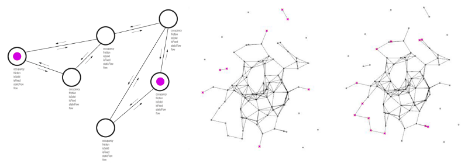
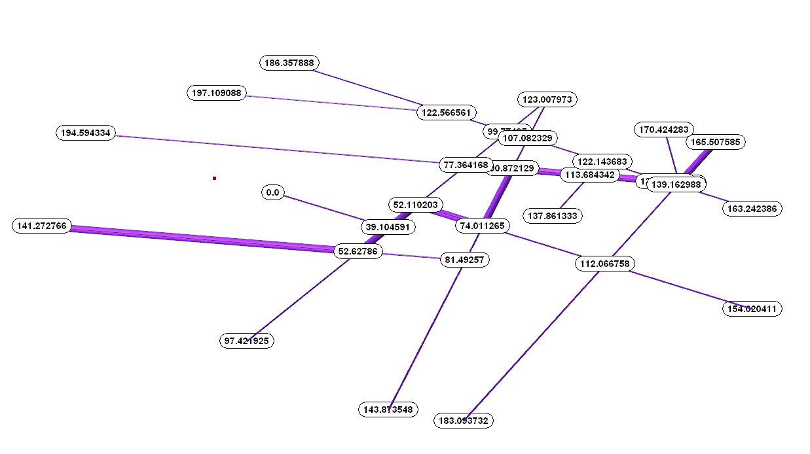
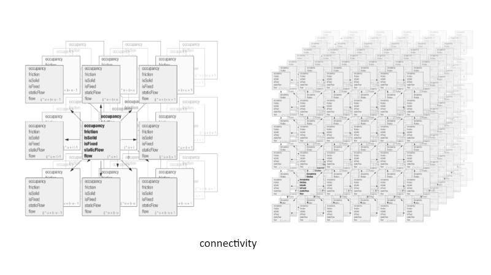

# Discrete Urban Space and Connectivity

[Medium](https://nj-namju.medium.com/discrete-urban-space-and-connectivity-492b3dbd0a81) 

**Subtitle: Partition & Relationship**

**_Keyword:_** Data Structure, Graph, Matrix, Pixel, Voxel, Discretization, Partition, Connection, Search

**_Workshop Reference  
_**_1\._ Computational Design Thinking for Designers — [link](https://medium.com/p/68224bb07f5c)(Eng)  
2\. Data & Design — [link](https://medium.com/p/c21457dc8dc/edit)(Eng) — [link](https://www.youtube.com/watch?v=7HwlZaJrTEI&t=1970s)(KR)

#### !We are able to answer these questions below.

**how to capture and process spatial data in design**

**Relationship among data in a space**

**Discrete a space into parts**

#### **1\. Graph**

Graph is a mathematical object that consists of set of points and edges, dealing with discrete information.

Graph is widely used for computation, discrete mathematics or representing relational data structures, and It has explicit relationship among vertices by edges visualizing the topological aspect such as street network of urban, highway or the subway map, whose graphs closely resemble their physical form due to its characteristics.

#### **2\. Pixel / Voxel (Volumetric Element)**

\- Voxel could be considered as a set of image(pixel)

Voxel is a 3 dimensional grid containing pixels can have rich data set including R, G, B, A values. It is frequently utilized for visualization of scientific or medical data which is needed for volumetric representation.

Voxel for geometry in space is a discretized space of geometry where it has a beam or node are connecting but as a continuous map in space. This is basically an idea that an object become a 3 dimensional map.

#### 3\. Partition

* [_Linear regression_](https://en.wikipedia.org/wiki/Linear_regression#:~:text=In%20statistics%2C%20linear%20regression%20is,is%20called%20simple%20linear%20regression.)_,_ [_KNN_](https://en.wikipedia.org/wiki/K-nearest_neighbors_algorithm) _,_ [Support vector machine](https://en.wikipedia.org/wiki/Support_vector_machine), [Random Forest](https://www.google.com/search?q=random+forest&sxsrf=ALeKk03VDUXmuXdKPiVomI9JY74xDiRjNQ:1597787912433&source=lnms&tbm=isch&sa=X&ved=2ahUKEwiPosnn36XrAhUKFzQIHXZhCJQQ_AUoAnoECBEQBA&cshid=1597787924979138&biw=2195&bih=1104&dpr=1.75), [CNN](http://www.njslab.com/NJSLabCore/?demo=503), [Tensorflow Playground](https://www.google.com/search?q=tensorflow+playground++gif&tbm=isch&ved=2ahUKEwi_5pqh6aXrAhXzJH0KHRwiDdIQ2-cCegQIABAA&oq=tensorflow+playground++gif&gs_lcp=CgNpbWcQA1CFXlikX2D9YmgAcAB4AIABQ4gBeZIBATKYAQCgAQGqAQtnd3Mtd2l6LWltZ8ABAQ&sclient=img&ei=8Vg8X_-pDfPJ9AOcxLSQDQ&bih=877&biw=1767&hl=en#imgrc=MYslOs49tI1vAM)

* [_Delaunay triangulation_](https://en.wikipedia.org/wiki/Delaunay_triangulation) _/_ [_Voronoi diagram_](https://en.wikipedia.org/wiki/Voronoi_diagram)

* [_Discrete space_](https://en.wikipedia.org/wiki/Discrete_space) _— S_[_pace Partitioning_](https://www.google.com/search?q=space+partitioning&tbm=isch&ved=2ahUKEwip6P70sMPqAhW8AjQIHb_BBT4Q2-cCegQIABAA&oq=space+partitioning&gs_lcp=CgNpbWcQARgAMgQIABBDMgIIADIGCAAQBRAeMgYIABAFEB4yBggAEAUQHjIGCAAQCBAeMgQIABAYMgQIABAYMgQIABAYMgQIABAYOgQIIxAnOgYIABAHEB46CAgAEAcQBRAeOggIABAIEAcQHlDcHVjaKGDPNWgAcAB4AIABR4gBhAOSAQE2mAEAoAEBqgELZ3dzLXdpei1pbWc&sclient=img&ei=hbwIX-mRLbyF0PEPv4OX8AM&bih=960&biw=1418)

* [_Quad Tree_](https://en.wikipedia.org/wiki/Quadtree) _/_ [_Octree_](https://en.wikipedia.org/wiki/Octree) _/ Bin System_

* [_Axis(AABB)_](https://developer.mozilla.org/en-US/docs/Games/Techniques/2D_collision_detection) _/_ [_Distance_](https://en.wikipedia.org/wiki/Circle_packing)Clustering Points: Collision-Based Dynamic Graph method _—_ [_link_](https://medium.com/p/798f660d86d4/)

#### 4\. Connectivity

* **GRAPH** — [link](https://en.wikipedia.org/wiki/Graph_theory#:~:text=In%20mathematics%2C%20graph%20theory%20is,also%20called%20links%20or%20lines%29.)  
* Graph Data Structure for Spatial data — [link(KR)](https://youtu.be/cUEQmPh57MU?list=PLweNVwGgDKEasb4RbUugM4ljH8oULTboc)

* _Social network as Graph —_ [_link_](https://www.google.com/search?q=social+network+graph&sxsrf=ALeKk007h1vJfEpDNJprlFGmxEzjomnw6g:1595195130211&source=lnms&tbm=isch&sa=X&ved=2ahUKEwj2l9X4pNrqAhVbJTQIHWYWCoIQ_AUoAXoECBEQAw&cshid=1595195174964846&biw=1696&bih=1094&dpr=1.75)_  
* Transportation as Graph (_[_Street_](https://www.google.com/search?q=Street+network&tbm=isch&ved=2ahUKEwjRxIioptrqAhXBCDQIHRw9C0YQ2-cCegQIABAA&oq=Street+network&gs_lcp=CgNpbWcQAzICCAAyAggAMgIIADICCAAyAggAMggIABAHEAUQHjIICAAQBxAFEB4yBggAEAUQHjIGCAAQBRAeMgYIABAFEB46BggAEAcQHjoICAAQCBAHEB5Qls4DWNnTA2D_3QNoAHAAeACAAVGIAYoBkgEBMpgBAKABAaoBC2d3cy13aXotaW1nwAEB&sclient=img&ei=asAUX9HnAsGR0PEPnPqssAQ&bih=1094&biw=1696&hl=en)_,_ [_freeway_](https://www.google.com/search?q=freeway+network&tbm=isch&ved=2ahUKEwjIsPqlptrqAhXEIH0KHQlHAtcQ2-cCegQIABAA&oq=freeway+network&gs_lcp=CgNpbWcQAzIECCMQJzIECCMQJzIGCAAQBRAeUPMWWMgZYLEbaABwAHgAgAE9iAF2kgEBMpgBAKABAaoBC2d3cy13aXotaW1nwAEB&sclient=img&ei=ZcAUX4jqJcTB9AOJjom4DQ&bih=1094&biw=1696&hl=en)_(highway),_ [_subway_](https://www.google.com/search?q=subway+rute&tbm=isch&ved=2ahUKEwiFu6zxpdrqAhWxGTQIHdZQBeAQ2-cCegQIABAA&oq=subway+rute&gs_lcp=CgNpbWcQAzoHCAAQsQMQQzoKCAAQsQMQgwEQQzoECAAQQzoFCAAQsQM6AggAOgQIABAYOggIABCxAxCDAToGCAAQCBAeUIgNWMc_YKxDaAhwAHgAgAFLiAG0A5IBATeYAQCgAQGqAQtnd3Mtd2l6LWltZ8ABAQ&sclient=img&ei=978UX8XjEbGz0PEP1qGVgA4&bih=1094&biw=1696&hl=en)_,_ [_sky way_](https://www.google.com/search?q=Air+route&hl=en&sxsrf=ALeKk00HsvHVsQ7nlpnBCXcJB33ZyJH5tw:1595195322655&source=lnms&tbm=isch&sa=X&ved=2ahUKEwjhg7fUpdrqAhV4CjQIHR0nDtQQ_AUoBHoECBEQBg&cshid=1595195339976896&biw=1696&bih=1094)_…)  
* Folder structure as Graph —_ [_link_](https://www.google.com/search?q=Folder+structure&tbm=isch&ved=2ahUKEwiexsvFptrqAhUIATQIHWCeDGIQ2-cCegQIABAA&oq=Folder+structure&gs_lcp=CgNpbWcQAzICCAAyAggAMgIIADICCAAyAggAMgIIADICCAAyAggAMgIIADICCABQ0IADWNCAA2DBhANoAHAAeACAAUyIAUySAQExmAEAoAEBqgELZ3dzLXdpei1pbWfAAQE&sclient=img&ei=p8AUX97WOoiC0PEP4LyykAY&bih=1094&biw=1696&hl=en)_Programming executions as Graph —_ [_link_](https://www.google.com/search?q=Programming+executions&sxsrf=ALeKk00ho3fkd5ncsfHwHCMsRhh3u5GnwA:1595195643423&source=lnms&tbm=isch&sa=X&ved=2ahUKEwjfkLHtptrqAhVoJTQIHXgPCwkQ_AUoA3oECBIQBQ&biw=1696&bih=1094&dpr=1.75)[_Zoning_](https://www.google.com/search?q=Zoning&tbm=isch&sxsrf=ALeKk02b9zbCR-pEB0Ts1Pa3G5V3B_6bPw:1595196543686&source=lnms&sa=X&ved=0ahUKEwiM7NSaqtrqAhXgJTQIHRyHDP8Q_AUIDygC&biw=1513&bih=925&dpr=1.75) _as Graph —_ [_link_](https://ennauata.github.io/housegan/page.html?fbclid=IwAR2pccIkeQ0pZlf-v_YAQxYeHMJ2VM0wZ_YwQzkM7UuUTwtgncQ75mYWM3c)_Associative geometry —_ [_link_](https://www.google.com/search?q=catia&tbm=isch&ved=2ahUKEwjvj6P0p9rqAhUdFTQIHRdLCLgQ2-cCegQIABAA&oq=catia&gs_lcp=CgNpbWcQAzIECCMQJzIECAAQQzIECAAQQzIFCAAQsQMyBAgAEEMyBAgAEEMyBAgAEEMyBAgAEEMyAggAMgIIAFC40wxY09QMYLHWDGgAcAB4AIABRogBgQGSAQEymAEAoAEBqgELZ3dzLXdpei1pbWfAAQE&sclient=img&ei=FsIUX--sEp2q0PEPl5ahwAs&bih=1094&biw=1696)_Interface —_ [_link_](https://www.google.com/search?q=grasshopper+interface&tbm=isch&ved=2ahUKEwj5zMasqNrqAhUjIX0KHeDQD7sQ2-cCegQIABAA&oq=grasshopper+interface&gs_lcp=CgNpbWcQAzICCAA6BAgjECc6BAgAEBg6BggAEAoQGDoFCAAQsQM6CAgAELEDEIMBOgYIABAIEB46BAgAEB5QyS5Y_0BgwkJoAHAAeACAAUKIAd4FkgECMTKYAQCgAQGqAQtnd3Mtd2l6LWltZ8ABAQ&sclient=img&ei=jMIUX_nWE6PC9APgob_YCw&bih=925&biw=1513) _/_ [_link_](https://www.google.com/search?q=3ds+max+creation+graph&tbm=isch&ved=2ahUKEwjh2YmxqNrqAhW-GTQIHQFHBrIQ2-cCegQIABAA&oq=3ds+max+creation&gs_lcp=CgNpbWcQARgAMgQIABAYOgUIABCxAzoCCAA6BAgAEEM6BwgAELEDEEM6BAgAEB46BggAEAgQHlD5swJYzdYCYKTeAmgCcAB4AIABSYgB8wiSAQIxOJgBAKABAaoBC2d3cy13aXotaW1nwAEB&sclient=img&ei=lcIUX6G7Mb6z0PEPgY6ZkAs&bih=925&biw=1513)_Network for ML —_ [_link_](https://www.google.com/search?q=tensorflow+graph&sxsrf=ALeKk02VqW1KsmXBLn_2NDe8XWdPhRPNOg:1597709460573&source=lnms&tbm=isch&sa=X&ved=2ahUKEwjr0-fGu6PrAhVZHjQIHQPECKQQ_AUoAXoECA4QAw&biw=2195&bih=1104&dpr=1.75)

* _Structure —_ [_link_](https://www.google.com/search?q=architectural+structures&tbm=isch&ved=2ahUKEwi03fmPh6PrAhUUoFsKHUGiC80Q2-cCegQIABAA&oq=architectural+structures&gs_lcp=CgNpbWcQAzIECCMQJzIECCMQJzICCAAyBggAEAUQHjIGCAAQBRAeMgYIABAFEB4yBggAEAUQHjIGCAAQBRAeMgYIABAFEB4yBggAEAUQHjoECAAQHlDYYFjiYWCTZGgAcAB4AIABQYgBfpIBATKYAQCgAQGqAQtnd3Mtd2l6LWltZ8ABAQ&sclient=img&ei=muU6X7SoNZTA7gLBxK7oDA&bih=1104&biw=2195&hl=en)_,_ [_link_](https://www.google.com/search?q=finite+analysis+structure+analysis&sxsrf=ALeKk02eqPldvk6sJ7d_1OXr9eX76GdCOA:1597784795305&source=lnms&tbm=isch&sa=X&ved=2ahUKEwjd8ZqZ1KXrAhWzHjQIHesOBC4Q_AUoAXoECAwQAw&biw=2195&bih=1104&dpr=1.75)[_Mesh(Polygon)_](https://en.wikipedia.org/wiki/Polygon_mesh) _as Graph —_ [_link_](https://www.google.com/search?q=polygon+modeling&tbm=isch&ved=2ahUKEwiuv8aVp9rqAhVLBTQIHV8eCZsQ2-cCegQIABAA&oq=polygon+modeling&gs_lcp=CgNpbWcQARgAMgIIADICCAAyBggAEAUQHjIGCAAQBRAeMgYIABAIEB4yBAgAEB4yBggAEAUQHjIECAAQGDIECAAQGDIECAAQGFC4FVjsFmD8HGgAcAB4AYABkgGIAZYCkgEDMi4xmAEAoAEBqgELZ3dzLXdpei1pbWfAAQE&sclient=img&ei=T8EUX-7bJ8uK0PEP37yk2Ak&bih=1094&biw=1696)Mesh from Rhino3d: [link](https://codepen.io/NJStudio/pen/vYNwqRy)

* _NJSTUDIO Presentation slide_

* _Data structure as Graph  
_[_JSON_](https://www.google.com/search?q=json&tbm=isch&ved=2ahUKEwjMjdjLqtrqAhU1kZ4KHSMoARcQ2-cCegQIABAA&oq=json&gs_lcp=CgNpbWcQAzIECCMQJzIHCAAQsQMQQzIHCAAQsQMQQzIECAAQQzIECAAQQzICCAAyBAgAEEMyAggAMgIIADICCABQwv8BWML_AWCPggJoAHAAeACAAUeIAUeSAQExmAEAoAEBqgELZ3dzLXdpei1pbWfAAQE&sclient=img&ei=5sQUX8yCHrWi-gSj0IS4AQ&bih=925&biw=1513) _/_[_GeoJSON_](https://www.google.com/search?q=geo+json&tbm=isch&ved=2ahUKEwjb5ZXEqtrqAhXTh54KHThAAdsQ2-cCegQIABAA&oq=geo+json&gs_lcp=CgNpbWcQAzICCAAyBggAEAoQGDIGCAAQChAYMgYIABAKEBgyBggAEAoQGDIGCAAQChAYMgYIABAKEBgyBggAEAoQGDIGCAAQChAYMgYIABAKEBg6BggAEAcQHjoICAAQCBAHEB5Q7mlYwXJg1nRoAXAAeACAAUaIAbkCkgEBNZgBAKABAaoBC2d3cy13aXotaW1nwAEB&sclient=img&ei=1sQUX9uiLNOP-gS4gIXYDQ&bih=925&biw=1513#imgrc=Y-harKV-bhjzIM) _as Graph  
_[_Matrix_](https://www.google.com/search?q=matrix+data+strcture&tbm=isch&ved=2ahUKEwjJqLz9qtrqAhWSkZ4KHf19BcgQ2-cCegQIABAA&oq=matrix+data+strcture&gs_lcp=CgNpbWcQAzoECCMQJzoCCAA6BggAEAUQHjoGCAAQCBAeOgQIABAYOgcIIxDqAhAnOgQIABBDOgUIABCxAzoHCAAQsQMQQzoKCAAQsQMQgwEQQzoICAAQsQMQgwFQrVFYoq0BYIuvAWgNcAB4AoABSogBkwuSAQIyM5gBAKABAaoBC2d3cy13aXotaW1nsAEKwAEB&sclient=img&ei=TsUUX8nJNpKj-gT9-5XADA&bih=925&biw=1513) _(_[_link_](https://en.wikipedia.org/wiki/Adjacency_matrix#:~:text=In%20graph%20theory%20and%20computer,with%20zeros%20on%20its%20diagonal.)_)_ [_Pixel_](https://www.google.com/search?q=pixel+data&sxsrf=ALeKk03VWzVyn4SA2y9yyZNMLh9VmQrAFw:1595197548822&source=lnms&tbm=isch&sa=X&ved=2ahUKEwjFz_n5rdrqAhXSMX0KHTxzA3EQ_AUoAnoECA4QBA&biw=2195&bih=1104)_(_[_link_](http://www.njstudio.co.kr/main/project/2016_MobilityEnergyConsumptionMITMediaLab/tool.html)_) and_ [_Voxel_](https://www.google.com/search?q=voxel+data+structure&tbm=isch&ved=2ahUKEwjc0MyCrtrqAhX7AzQIHaOCBsAQ2-cCegQIABAA&oq=voxel+data+st&gs_lcp=CgNpbWcQARgAMgQIIxAnOgQIABAeOgQIABAYUI0lWJYpYJoyaABwAHgAgAE_iAG8AZIBATOYAQCgAQGqAQtnd3Mtd2l6LWltZ8ABAQ&sclient=img&ei=fsgUX9yZOvuH0PEPo4WagAw&bih=1104&biw=2195)_(_[_link_](http://designju.cafe24.com/main/project/2017_thesisVoxelHarvardGSD/public)_) as Graph_

**TYPE**

* [Directed Graph](https://en.wikipedia.org/wiki/Directed_graph) / [Undirected Graph](https://mathinsight.org/definition/undirected_graph#:~:text=An%20undirected%20graph%20is%20graph,is%20called%20a%20directed%20graph.) / [Mixed Graph](https://en.wikipedia.org/wiki/Mixed_graph#:~:text=A%20mixed%20graph%20G%20%3D%20%28V,edges%20%28or%20arcs%29%20A.) / [Weighted Graph](http://www.mathcs.emory.edu/~cheung/Courses/171/Syllabus/11-Graph/weighted.html)  
* … Multigraph / Bipartite Graph / DAG(Directed Acyclic Graph)

**SEARCH / TRAVERSAL —** [**link**](https://en.wikipedia.org/wiki/Graph_traversal#:~:text=In%20computer%20science%2C%20graph%20traversal,which%20the%20vertices%20are%20visited.)

* Graph Data Structure And Algorithms _—_ [_link_](https://www.geeksforgeeks.org/graph-data-structure-and-algorithms/)
* [_DFS_](https://en.wikipedia.org/wiki/Depth-first_search) _/_ [_BFS_](https://en.wikipedia.org/wiki/Breadth-first_search) _examples —_ [_CodePen_](https://codepen.io/NJStudio/pen/bGdozYY?editors=1011)

#### 3\. Example

* [Rigid body](https://en.wikipedia.org/wiki/Rigid_body#:~:text=In%20physics%2C%20a%20rigid%20body,external%20forces%20exerted%20on%20it.): [link](http://www.njslab.com/NJSLabCore/?demo=25)  
* Agent Boids System A: [link](http://www.njslab.com/NJSLabCore/?demo=35)  
* Agent Boids System B: [link](http://www.njslab.com/NJSLabCore/?demo=36)  
* Rect Pos Optimizer: [link](http://www.njslab.com/NJSLabCore/?demo=19)  
* Graph system: [link](http://www.njslab.com/NJSLabCore/?demo=23)
* Three, Terrain, pixel map(matrix): [link](https://codepen.io/NJStudio/pen/WNreJdy)  
* Rhino Grasshopper, Terrain, pixel map(matrix): link  
* Three, Voxel map: [link](https://codepen.io/NJStudio/pen/QWyLraB)

-----
**ADDITIONAL NOTE**

Discrete Urban Space and Connectivity— [link](https://medium.com/@nj.namju/discrete-urban-space-and-connectivity-492b3dbd0a81)

Numeric Network Analysis: Post-COVID-19 Urbanism, 6 ft rule — [link](https://medium.com/@nj.namju/numeric-network-analysis-post-covid-19-urbanism-6-ft-rule-de267886b028)

**VERSION**

NNA\_V2\_Beta\_0.5.2 Addon — [link](https://www.dropbox.com/s/e9b3btvl1b2kra5/2020_beta_V2_01_addonGH.zip?dl=0)  
NNA\_V2\_Beta\_0.5.2 Example — [link](https://www.dropbox.com/s/e9b3btvl1b2kra5/2020_beta_V2_01_addonGH.zip?dl=0)

**GRAPH TUTORIAL**

Rhino Grasshopper Python — [link](https://www.dropbox.com/s/k1gaalgimte87u1/Tutorial_A_Graph.gh?dl=0)

Jupyter Notebook — [link](https://github.com/NamjuLee/Introduction-to-computational-design-python-notebook)
